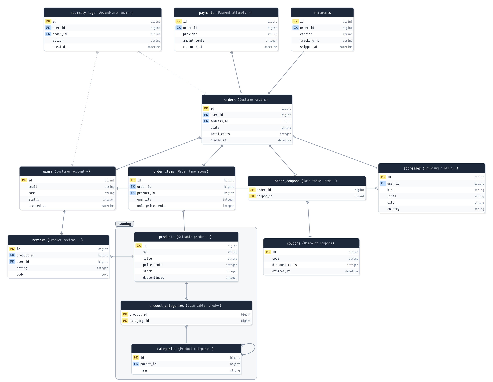
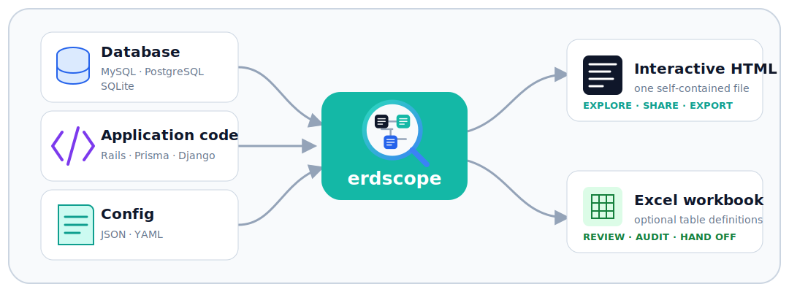

<div align="center">
  

  **データベース、アプリケーションコード、設定ファイル。手元にあるものから、探索できるスキーマを。**

  [](https://github.com/orapli/erdscope/actions/workflows/ci.yml)
  [](https://pypi.org/project/erdscope/)
  [](https://pypi.org/project/erdscope/)
  [](LICENSE)

  [ライブデモ](https://orapli.github.io/erdscope/) · [ユーザーマニュアル](https://orapli.github.io/erdscope/manual.html) · [日本語マニュアル](https://orapli.github.io/erdscope/manual.ja.html)
</div>

erdscopeは、**自己完結型のインタラクティブなER図**と、必要に応じて
**Excelテーブル定義書**を生成します。データベース、モデルコード、設定ファイル、
またはそれらの組み合わせから始められます。生成されるのは、探索・共有でき、
プロジェクトと一緒に保管できる単一のポータブルなHTMLファイルです。

```bash
pip install erdscope
erdscope demo
```

クイックスタートはこれだけです。データベースもアカウントもプロジェクト設定も不要で、
サンプルのショップER図がブラウザで開きます。

[](https://orapli.github.io/erdscope/)

## 手元にあるスキーマを、そのまま入力に

<div align="center">
  
</div>

| 入力元 | erdscopeが読み取るもの | 向いている用途 |
|---|---|---|
| **データベース** | MySQL、PostgreSQL、SQLiteのカタログ | 実際にデプロイされているスキーマの調査 |
| **アプリケーションコード** | Rails、Prisma、Djangoプロジェクト | データベースへ接続せずにプロジェクトをレビュー |
| **設定ファイル** | JSONまたはYAMLの入力宣言、テーブル、リレーション、ノート、グループ | 設定の再利用、スキーマ設計、ドキュメントの追加 |

入力元は1つだけでも、組み合わせても構いません。データベースの物理情報、
アプリケーションレベルの関連、明示的に記述したドキュメントを、
一貫した1つのビューへ統合します。

以下の例では、入力が分かりやすい場合はCLI引数を使っています。繰り返し使う設定や
モデル入力は、`.erdscope.json`、`.erdscope.yml`、または`--config`で指定した
ファイルへまとめられます。設定ファイルだけで完全なスキーマを定義することもできます。
同じ項目を両方で指定した場合は、明示的なCLI引数が設定ファイルより優先されます。

## 目的に合った始め方

### 稼働中のデータベースを調査する

```bash
erdscope postgres://readonly@127.0.0.1:5432/myapp -o schema.html
```

MySQLでも同じ形式を使えます。SQLiteはドライバー不要で、Python標準ライブラリだけで動作します。

```bash
erdscope sqlite:///path/to/app.db -o schema.html
```

### データベースなしでアプリケーションモデルをレビューする

```bash
# Rails、Prisma、Djangoプロジェクトを自動判定
erdscope --models ./my-app -o schema.html
```

### 設定ファイルだけでスキーマを設計・文書化する

```bash
erdscope --config examples/schema-only.json -o schema.html
```

[`examples/schema-only.json`](examples/schema-only.json)は、テーブル、リレーション、ノート、
ドメイングループを含む、データベース不要の完全なサンプルです。設定ファイルでは、
他の入力元から得た項目を上書き・削除することもできます。詳しくは
[設定ファイルガイド](https://orapli.github.io/erdscope/manual.ja.html#config-file)を参照してください。

### データベース、アプリケーション、ドキュメントを統合する

```bash
erdscope mysql://readonly@127.0.0.1:3306/myapp \
  --config .erdscope.yml \
  -o schema.html
```

```yaml
# .erdscope.yml
models:
  - ./app/models
groups:
  - { id: sales, title: Sales, tables: [orders, order_items] }
notes:
  - id: order-retention
    target: { type: table, table: orders }
    text: アカウント閉鎖後も注文情報を7年間保持します。
```

ここで、階層化された入力モデルが効果を発揮します。カラムと実在する外部キーは
データベースから、ポリモーフィック関連やthrough関連などはコードから、修正情報、
ドメイングループ、運用ノート、ADRリンクは設定ファイルから取り込めます。

### ER図とテーブル定義書をまとめて引き渡す

```bash
erdscope sqlite:///path/to/app.db \
  -o schema.html \
  --excel table-definitions.xlsx
```

HTMLは自己完結型で、Excelテンプレートを使ってワークブックの書式を変更できます。
レビュー、監査、オンボーディング、ドキュメント納品に便利です。

## ビューアーでできること

- テーブル、カラム、コメント、添付したノートを検索できます。
- 依存先・依存元へフォーカスし、辿る深さを調整できます。
- テーブルを非表示にし、レイアウトを変更し、ドメイングループをまとめて移動できます。
- DB外部キー、スキーマ外部キー、宣言された関連、推測されたリレーションを識別できます。
- 名前付きビューを保存し、現在の表示状態をリンクで共有できます。
- 現在のキャンバスをPNGまたはSVGで書き出し、印刷できます。
- ダークモードへ切り替えられ、すべての処理は生成したHTML内でローカルに動作します。

**[ライブデモ](https://orapli.github.io/erdscope/)**で操作を試すか、図入りの
**[ビューアーガイド](https://orapli.github.io/erdscope/manual.ja.html#viewer-guide)**をご覧ください。

## インストール

```bash
pip install erdscope
```

コアCLI、SQLiteリーダー、HTMLジェネレーター、Excelライターは、Python標準ライブラリ
だけで動作します。データベースサーバーへ直接接続する場合は、必要なドライバーを追加します。

```bash
pip install 'erdscope[mysql]'     # PyMySQL
pip install 'erdscope[postgres]'  # psycopg
pip install 'erdscope[yaml]'      # .yml/.yaml設定用のPyYAML
pip install 'erdscope[all]'
```

単一ファイルで使いたい場合は、[`erd.py`](erd.py)をダウンロードし、Python 3.9以降で実行します。

```bash
python3 erd.py demo
```

## 設定ファイルとCLI引数

繰り返し使う入力や設定は、設定ファイルへまとめると便利です。カレントディレクトリの
`.erdscope.json`、`.erdscope.yml`、`.erdscope.yaml`は自動検出され、`--config`で
任意のファイルを指定することもできます。同じ項目を両方で指定した場合は、
明示的なCLI引数が優先されます。

| オプション | 用途 |
|---|---|
| `--config PATH` | モデル入力、デフォルト値、スキーマ定義・修正、ノート、グループを読み込む |
| `--models PATH` | 設定ファイルの`models`をRails、Prisma、Django入力で上書き。複数指定可能 |
| `--excel FILE.xlsx` | テーブル定義のExcelワークブックも生成する（notes/groups設定時はNotes/Groupsシートも含む） |
| `--emit-json FILE.json` | スキーマの正規JSONスナップショット（内容フィンガープリント付き）も書き出す（`-`で標準出力） |
| `--emit-config FILE.yml\|.json` | スキーマを設定ファイル形式でも書き出す。`--config`で再取込可能（`-`で標準出力、常にJSON） |
| `--diff SNAPSHOT.json` | 保存済みの`--emit-json`スナップショットと比較し、出力を生成する代わりに0/1/2で終了する（CIドリフトゲート） |
| `--emit-digest FILE.md` | 設計メモ付きの、LLM/エージェント向けトークン効率の良いMarkdownダイジェストも書き出す（`-`で標準出力、`--digest-verbose`でnullable/default/sql_typeを追加） |
| `--emit-dbml FILE.dbml` | スキーマの最小限のDBMLエクスポートも書き出す — テーブル/カラム/インデックス/単一カラムFKのリレーション/テーブルコメント（`-`で標準出力、notes/groups/`TableGroup`は含まない） |
| `--only 'user*,order*'` | 一致するテーブルだけを生成する |
| `--exclude '*_logs'` | 一致するテーブルを除外する |
| `--infer-fk` | `*_id`カラムから推測したリレーションを、明確に区別して追加する |
| `--no-open` | `demo`実行後にブラウザを開かない |

すべてのオプションと設定キーは、**[CLI・設定リファレンス](https://orapli.github.io/erdscope/manual.ja.html#cli-reference)**を参照してください。

## 対応する入力

erdscopeは、MySQL 8.4、PostgreSQL 16、CPython同梱のSQLite、Rails 7.x/8.x
プロジェクト、Prisma 5/6のスキーマ、Django 4.2/5.xのモデルでテストされています。
詳しい条件とパーサーの対応範囲は、
[互換性ガイド](https://orapli.github.io/erdscope/manual.ja.html#verified-versions)に記載しています。

## プロジェクト資料

- **[ライブデモ](https://orapli.github.io/erdscope/)** — 生成されたショップスキーマを操作できます。
- **[ユーザーマニュアル](https://orapli.github.io/erdscope/manual.ja.html)** — セットアップ、ビューアー、設定、エクスポート、トラブルシューティングの完全なガイドです。
- **[サンプル](examples/)** — すぐに実行できるSQLite入力と設定ファイルのみの入力です。
- **[変更履歴](CHANGELOG.md)** — リリースごとの機能と動作変更です。
- **[Issue](https://github.com/orapli/erdscope/issues)** — 不具合報告と機能リクエストです。

## 開発

ソースコードは`src/erdscope/`にあり、配布用の`erd.py`はそこから生成されます。

```bash
python3 -m unittest discover -s tests -v
python3 tools/build_single_file.py --check
```

プロバイダー、マージ動作、ビューアー、生成物を変更する前に、
[開発クイックスタート](openwiki/quickstart.md)を確認してください。

## ライセンス

[MIT](LICENSE)
